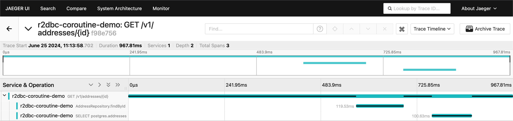
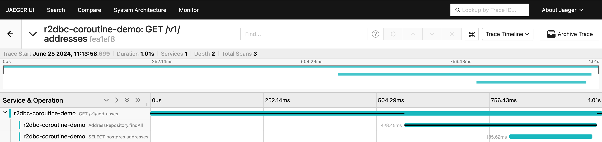

# Spring Data with R2DBC OpenTelemetry instrumentation issues demo project

## Pre-requisites

- `JAVA_HOME` pointing to Java 21+
- Docker installed and started
- Docker Compose installed and on PATH

## Getting Started

- clone the repository; `cd` into working directory
- run `./gradlew bootBuildImage`
- run `cd docker`
- run `docker compose up -d`
- make sure all the containers are shown as "Started" and/or "Healthy"
- open [http://localhost:16686/search](http://localhost:16686/search) in the browser
- select `GET /v1/addresses/{id}` from Operation combo-box
- click `Find Traces`
- select the one that is annotated with `GET /v1/addresses/{id}`
- you should be seeing something like this:

Note that the span annotated as `AddressRepository.findById` is so short and both starts and ends BEFORE the actual SQL statement (span below it) begins and ends.

At the same time span annotated as `AddressRepository.findAll` shown corrected. It can be found via `Find Traces` as well.

